# trampo
> A web platform where workers can connect with customers.

> 

A final school project called T.C.C. (Trabalho de conclusão de curso), that aim to connect workers with customers, using their geolocations and filters.

## Used techs/features

- PHP
- HTML, CSS and JavaScript
- XAMPP server

## Installation

For running this project, you need have a server to execute the PHP and a MySQL Database, you can use a tool to create a local server like **XAMPP** or **WampServer**.

- Add the `trampo.sql` to your MySQL
- Run your server
- Go to `trampo/View/Home/`

## Project Screenshots (Desktop)

Below, there are some screenshots of the project on the desktop screen.

> ### Home page
> 

> ### Register form
> 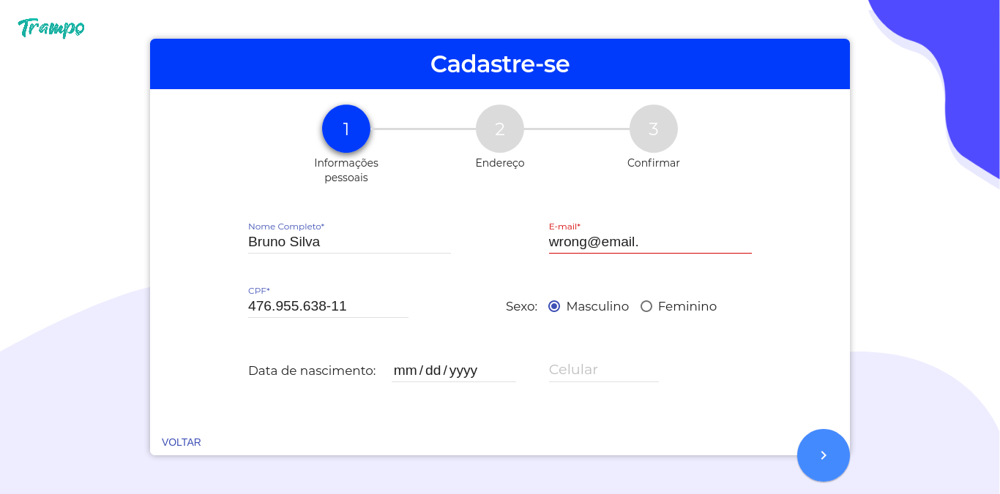

> ### Login form
> 

> ### Progress tab
> 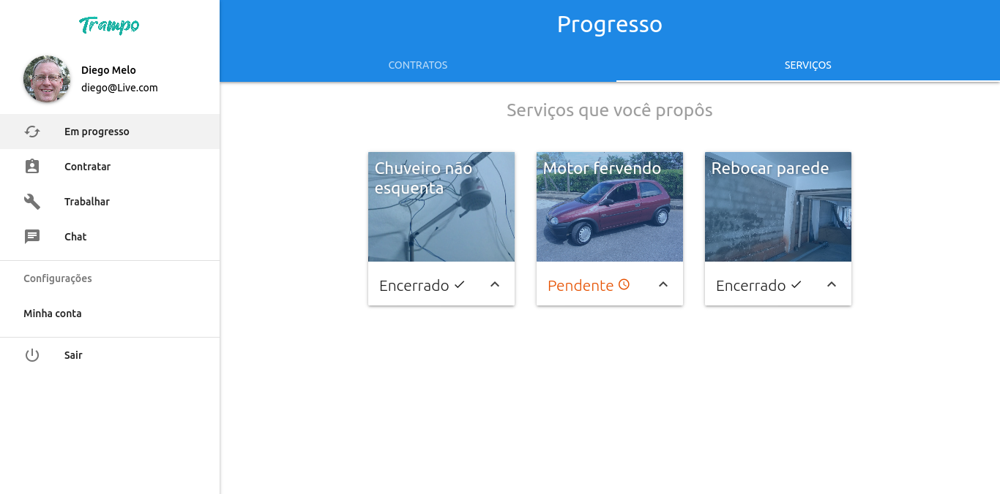

> ### Hire tab
> 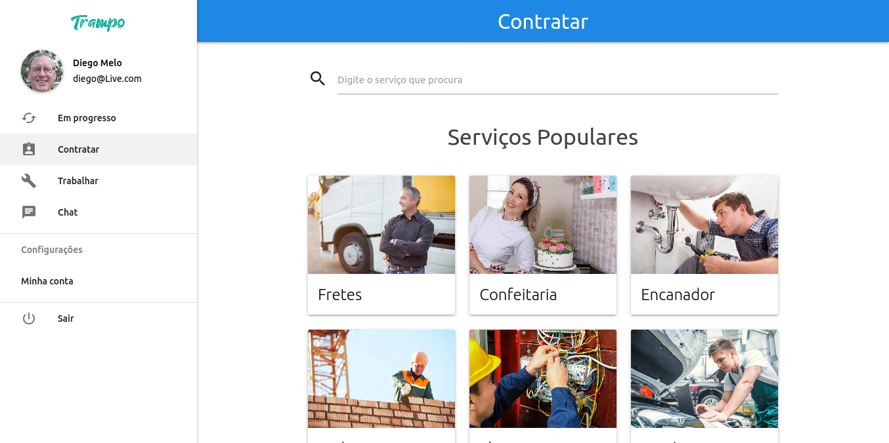

> ### Hire form
> 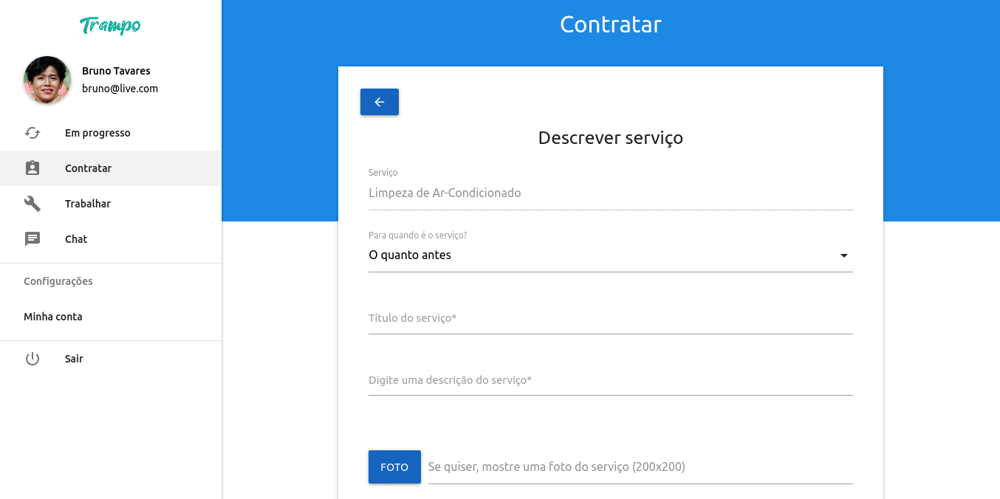

> ### Workers list
> 

> ### User profile
> 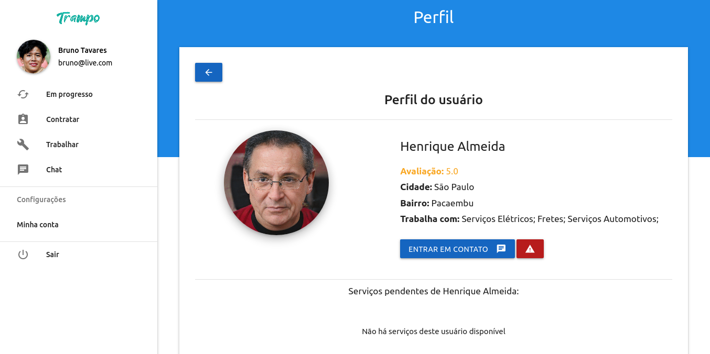

> ### Chat
> 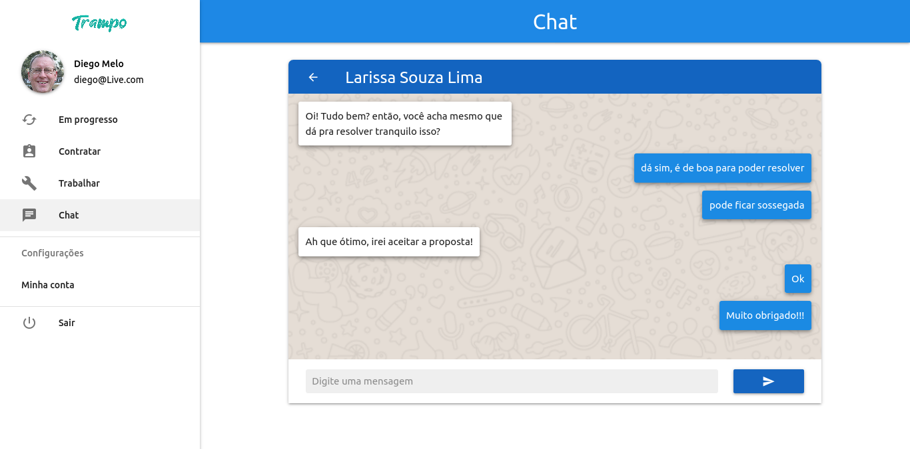

> ### Works list
> 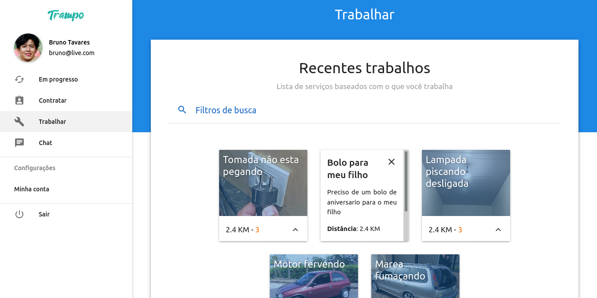

> ### Filter
> 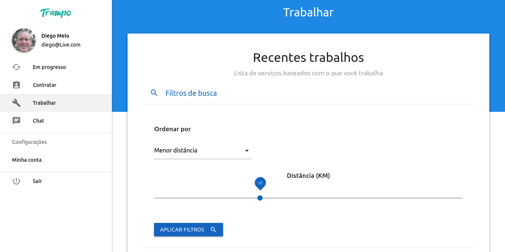

> ### Service description
> 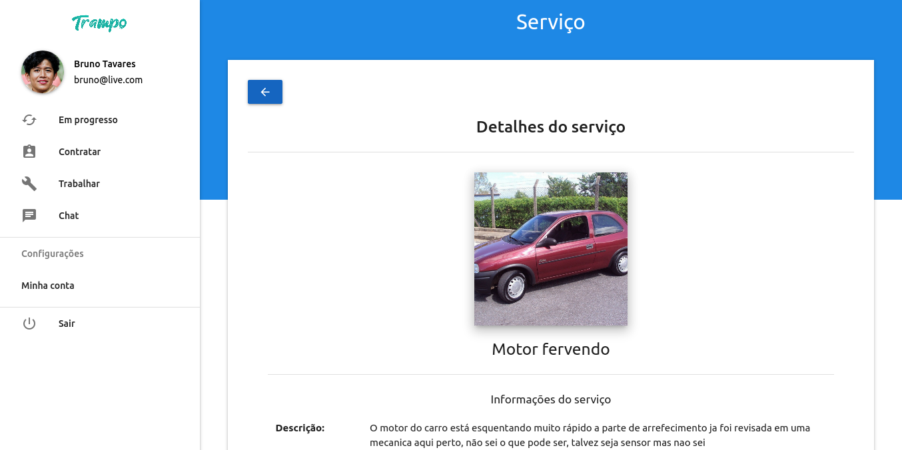

> ### Service offer
> 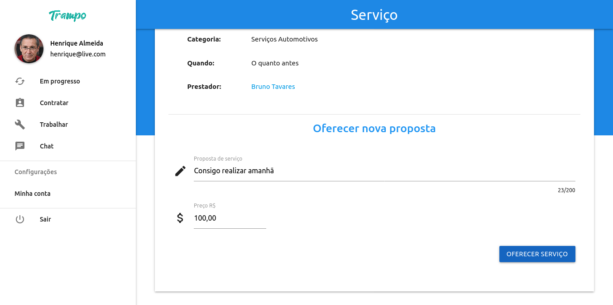

> ### Service request
> 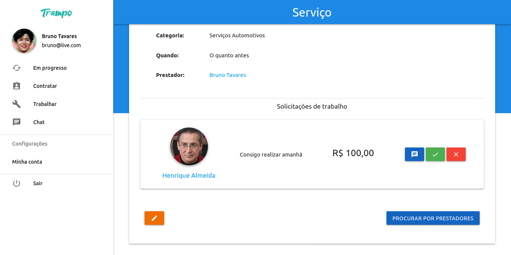

> ### Report
> 

> ### Rating
> 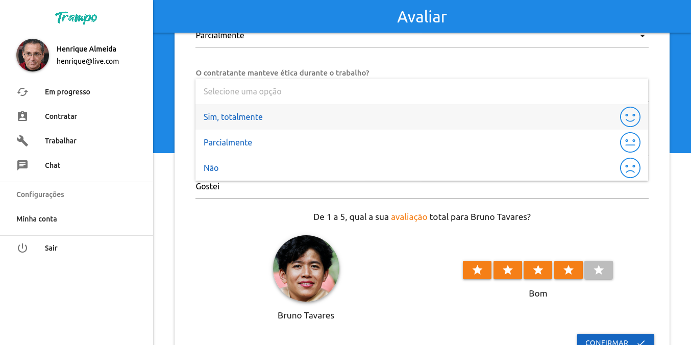

> ### Account settings
> 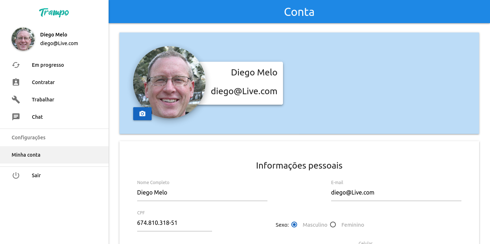

## Project Screenshots (Mobile)

> ### Home page
> 

